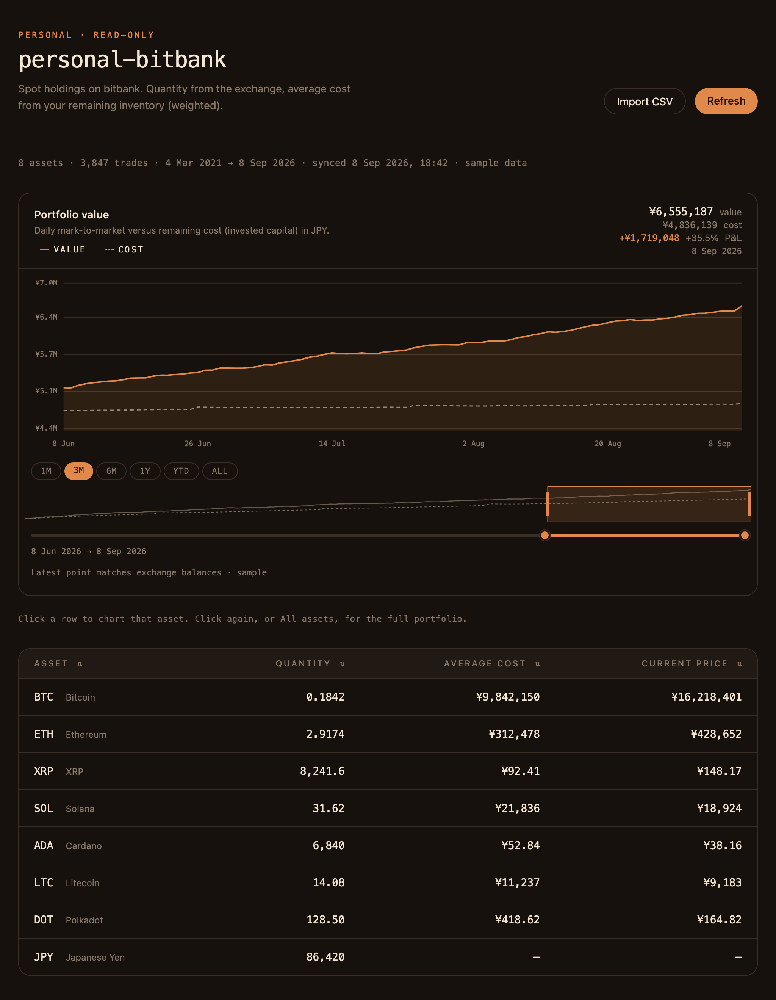
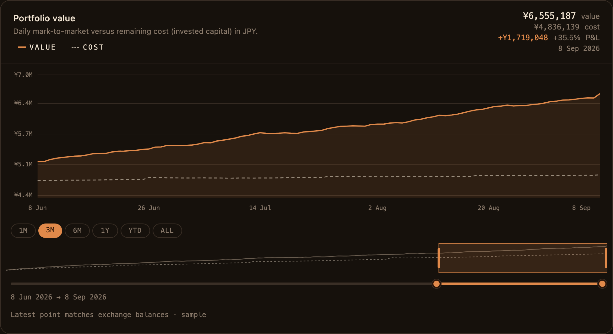

<div align="center">

# personal-bitbank

**Local, read-only dashboard for your [bitbank](https://bitbank.cc/) spot account.**

Quantity from the exchange. Weighted average cost rebuilt from your fills. Live JPY prices and a daily value chart.

<p>
  
  
  
  
  
  
  
  
  
</p>

<p>
  
</p>

<sub>Figures in screenshots are sample data, not a live account.</sub>

</div>

---

## Why

bitbank’s assets API returns **balances**, not **average cost**. This app stays on your machine, uses a **read-only** API key, and reconstructs remaining-inventory cost from spot history.

| You see | Where it comes from |
| --- | --- |
| Quantity | Exchange `onhand` |
| Average cost | Weighted remaining lots from fills |
| Current price | Public ticker (`*_jpy`, or via BTC) |
| Portfolio value | Daily candles × reconstructed holdings, pinned to today |

<p align="center">
  
</p>

## Features

- **Weighted average cost in JPY** — buys add cost (quote fees in); sells leave the average unchanged; BTC-quoted pairs transfer JPY cost
- **Live prices** next to cost, so you can compare basis to the market
- **Daily mark-to-market chart** from first fill → today, with `1M` / `3M` / `6M` / `1Y` / `YTD` / `ALL` and a drag slider
- **CSV backfill** for years the API no longer returns (bitbank **約定履歴**)
- **History-gap warnings** when reconstructed qty ≠ exchange qty (deposits, withdrawals, margin)
- **Local only** — keys never go to the browser; cache lives in `.data/`

Margin fills are skipped for now.

## Setup

1. In bitbank, create a **read-only** API key (no order or withdraw).
2. Copy env and paste the key:

```bash
cp .env.example .env.local
```

```bash
BITBANK_API_KEY=...
BITBANK_API_SECRET=...
```

3. Run it:

```bash
npm install
npm run dev
```

Or Docker (keys and `.data/` stay on this machine):

```bash
npm run up      # builds the image if needed, then starts
npm run down    # stops
```

Open [http://localhost:3000](http://localhost:3000).

## Long history

Trade history is paged (1000 per request) and cached in `.data/trades.json` (gitignored). Later refreshes only fetch fills newer than the cache. Daily candles for the chart live in `.data/portfolio.sqlite`.

If you have been trading for years and quantities do not match, import bitbank’s **約定履歴** CSV:

bitbank → profile menu → **データ** → **約定履歴** → extract / download.

## Scripts

| Command | What it does |
| --- | --- |
| `npm run dev` | Next.js dev server |
| `npm test` | Vitest |
| `npm run build` | Production build |
| `npm run up` | Start Docker (build if missing) |
| `npm run down` | Stop Docker |
